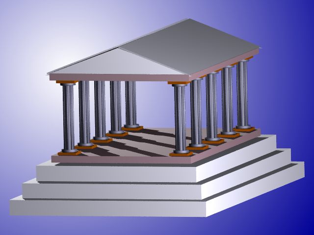

## 3DWorld - система моделирования и визуализации трёхмерных фото-реалистических сцен в среде MS Windows 3.1

[Полная документация](./Doc/MP1.DOC) 
[Исполняемые файлы Win16 и примеры 3D-сцен](./releases/download/Release1/3DW_exe.zip)
>Для запуска использовать 3dw.exe. В 32-х или 64-х разрядных средах требуется наличие WOW. Последние системы, где WOW есть по умолчанию, это Win XP и WIn 7. В Windows 10 можно разрешить NTVDM: [Enabling NTVDM in Windows 10](https://www.groovypost.com/howto/enable-16-bit-application-support-windows-10/).

Данная работа посвящена созданию пакета прикладных программ машинной графики 3DWorld, предназначенного для получения фото реалистических изображений, а также содержит минимально необходимый набор средств для их обработки.   При его разработке ставилась задача создать средство для моделирования трёхмерных сцен из произвольных объектов с произвольным их расположением и характеристиками материалов, а также реалистического освещения с характерными для него эффектами. Набор моделируемых в пакете эффектов был обусловлен выбранной степенью точности воспроизведения освещения - локальной моделью. Исходя из этого были реализованы:

* рассеянное, диффузное и зеркальное освещение;
* перспективное затенение относительно источников света (так как используются только ортогональные проекции);
* собственные и проекционные тени;
* простая прозрачность (линейная и нелинейная).

Пакет 3DWorld версии 1.0  состоит из двух приложений: редактора трёхмерных сцен и объектов и просмоторщикаконвертора True colour изображений. Редактор сцен является основным приложением пакета и обеспечивает три главные функции пакета:

* создание и редактирование трёхмерной сцены;
* визуализацию (рендеринг сцены);
* обработку полученного изображения.

Просмоторщик-конвертор выполняет функцию преобразования True color изображений в формате Windows bitmap (только uncompressed) в индексированные Windows bitmap изображения с произвольной длиной палитры (2 - 256) и предлагает на выбор несколько алгоритмов такого преобразования в комбинации с функциями улучшения качества получаемых картинок. Он в основном дублирует функции содержащиеся по этой части в редакторе сцен, но предоставляет к ним индивидуальный интерфейс пользователя, что делает возможным хранить исходные True color  файлы и по мере необходимости применять к ним те или иные преобразования, а также обрабатывать сканированные изображения и файлы других приложений алгоритмами 3DWorld.  По существу просмоторщик-конвертор использует одну и туже DLL-библиотеку 3DWorld обработки изображений с редактором сцен, но о структуре пакета будет рассказано подробней в технологическом разделе.
Редактор сцен обеспечивает одновременную работу с множеством разных сцен (в виде MDI) в режиме мнимой многопоточности. Каждая из сцен может иметь одно или несколько окон с разными видами и режимами просмотра полигональных моделей объектов (источников света и тел). Редактор сцен содержит меню, плавующую панель инструментов и строку статуса через которые пользователь получает доступ к функциям программы, может использовать набор примитивов работы с объектами и переключать текущие режимы. Ядро 3DWorld со своим набором объектов и таким интерфейсом в сочетании с набором функций, приметивов и режимов редактора сцен 3DWorld обеспечивает:
1. Просмотр любых участков и сцен вцелом с любой стороны и в любом масштабе.
1. Наличие множественных окон для каждой сцены в сочетании с предыдущим пунктом способствует адекватному восприятию модели трёхмерного пространства человеком.
1. Создание объектов (генератор тел из предопределённого набора), редактирование объектов и их взаимоположения на виде (окне) с любым режимом просмотра (кроме Render и Camera) - линейные преобразования пространства над отдельными объектами и группами объектов.
1. Вспомогательные операции по взаимному размещению объектов, облегчающие создание естественных сцен с регулярным расположением объектов и специфическую их ориентацию в пространстве.
1. Настройка параметров объектов (характеристики поверхности, источников света).
1. Вспомогательные функции менеджера окон обеспечивающие интеллектуальное поведение окон с видами в ответ на действия пользователя и в зависимости от состояния системы.
1. Хранение сцен и текущих опций и режимов редактирования в файле.
1. Визуализацию смоделированных сцен с выбором алгоритма (обратная трассировка лучей или построчное сканирование с Z-буфером), дополнительных параметров визуализации и типа выходного изображения с настройкой его параметров (BMP True color или индексированный). Проецирование в 3DWorld 1.0 используется только ортогональное, в обоих алгоритмах рендеринга возможно построение проекционных теней методом трассировки лучей.
1. Поддержка при рендеринге двух алгоритмов закраски поверхностей с использованием групп сглаживания: FLAT  и PHONG .
1. Дополнительные возможности по улучшению качества изображений - получение сглаженных краёв и ровной закраски на этапе трассировки лучей (anti-aliasing - только для рендеринга в режиме трассировки) и устранение эффектов квантования при получении индексированных изображений на этапе обработки полученного изображения (dither и noisy).
1. Просмотр и сохранение в файле Windows bitmap  (uncompressed) полученного изображения.
1. Поддерживается технология обмена файлами drag and drop (получатель) и фоновая визуализация множества сцен одновременно (много потоковая обработка), во время которой пользователь может выполнять любые действия с незаблокированными сценами (визуализируемые сцены блокируются) или работу в других приложениях.

Общее назначение пакета - создание изображений ориентированных на художественный дизайн и применение в области мультимедиа. В перспективе возможно также добавление функции обмена через графические метафайлы с другими приложениями, например, такими как пакеты САПР Autocad и Arhicad, что возможно благодаря степени полноты использованных моделей трёхмерных объектов. И тогда 3DWorld уже будет служить инструментом, позволяющим увидеть как будут выглядеть уже спроектированные, но ещё не созданные реальные объекты. Он также может быть расширен и возможностью построения анимационных последовательностей.

## Примеры визуализаций
<table>
    <tr>
        <td>Несколько точечных источников света</td>
        <td>Сглаживание</td>
    </tr>
    <tr>
        <td></td>
        <td></td>
    </tr>
    <tr>
        <td>Прозрачность</td>
        <td>Пересечение торов</td>
    </tr>
    <tr>
        <td></td>
        <td></td>
    </tr>
    <tr>
        <td>Храм</td>
        <td>Храм</td>
    </tr>
    <tr>
        <td></td>
        <td></td>
    </tr>
    <tr>
        <td>Пересечение тел</td>
        <td>Библиотека базовых моделей</td>
    </tr>
    <tr>
        <td></td>
        <td></td>
    </tr>
    <tr>
        <td>Сложная модель</td>
        <td>Смешивание цветов</td>
    </tr>
    <tr>
        <td></td>
        <td></td>
    </tr>
    <tr>
        <td>Группы сглажиывния Гуро</td>
        <td>Источник света в прозрачном теле</td>
    </tr>
    <tr>
        <td></td>
        <td></td>
    </tr>
    <tr>
        <td>Тени</td>
        <td>Пересечение тел</td>
    </tr>
    <tr>
        <td></td>
        <td></td>
    </tr>
    <tr>
        <td>Отражение света от точечного источника</td>
        <td>Линейная и нелинейная прозрачность</td>
    </tr>
    <tr>
        <td></td>
        <td></td>
    </tr>
    <tr>
        <td>Прозрачность</td>
        <td>Сложная модель</td>
    </tr>
    <tr>
        <td></td>
        <td></td>
    </tr>
</table>
